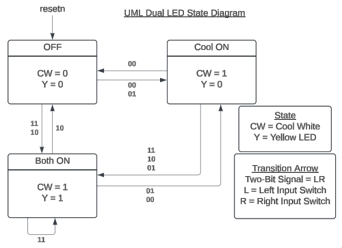
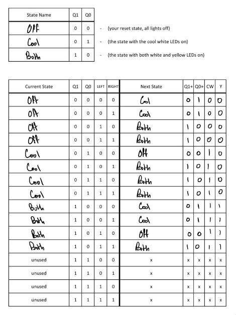
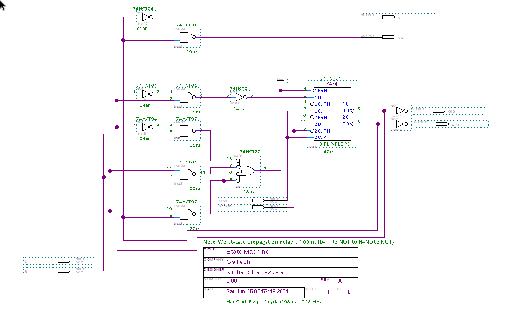
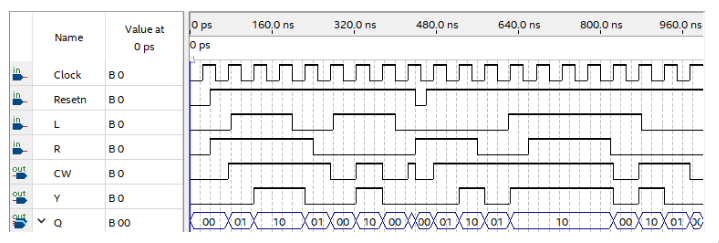
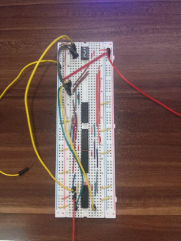
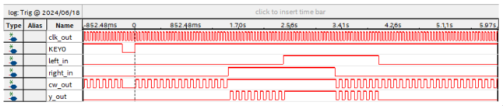

# Dual LED Lighting System with Adjustable Intensity

This project implements a dual LED lighting system with adjustable intensity and color temperature, controlled by two input switches. It utilizes two LEDs—one cool white and one yellow to create customizable ambient lighting conditions. 

Implemented in:
- Physical wiring circuit
- FPGA (vhdl)

## Features

- **Cool White LED** and **Yellow LED** for adjustable color temperature.
- **Two Input Switches** to control light intensity and color combinations.
- **Dynamic Lighting Modes** based on switch combinations:
  - **No switches on**: Cool white LED at 50% intensity.
  - **Left switch on**: Both LEDs at 50% intensity.
  - **Right switch on**: Cool white LED at 100% intensity, yellow LED at 50%.
  - **Both switches on**: Both LEDs at 100% intensity.

## Lighting Modes Summary

| Left Switch | Right Switch | Cool White LED Intensity | Yellow LED Intensity |
|-------------|--------------|--------------------------|-----------------------|
| Off         | Off          | 50%                      | 0%                    |
| On          | Off          | 50%                      | 50%                   |
| Off         | On           | 100%                     | 50%                   |
| On          | On           | 100%                     | 100%                  |

## UML State Diagram

## Transition Table

Transition table that describes the dual-LED system, which is a Moore state machine.  
This table will be used to derive Boolean expressions to be implemented in a breadboard prototype.  
Q1 and Q0 represent the current state, whereas Q1+ and Q0+ represent the next state. 

## Boolean Equations

From the transition table, a K-Map was performed to derive the following boolean equations.  
`CW = Q0 + Q1`
`Y = Q1`
`Q1+ = (L * R) + (Q0 * R) + (~Q1 * L)`
`Q2+ = ~L * ~Q0`

## Wiring Schematic

## Quartus Waveform Simulation

Simulation to test whether the wiring schematic's current state and inputs provide expected results in both the output and next state.

## Implemented Circuit

Breadboard prototype of dual-LED state machine.  
SPST DIP switches are used to implemented L, R, and Resetn signals.

## Digital Anaylzer Acquisition

Successful digital analyzer acquisition shows trigger event at KEY0 (resetn) rising edge.  
Multiple input and output signals recorded.  
Similar results to corresponding dual-LED system simulation.
